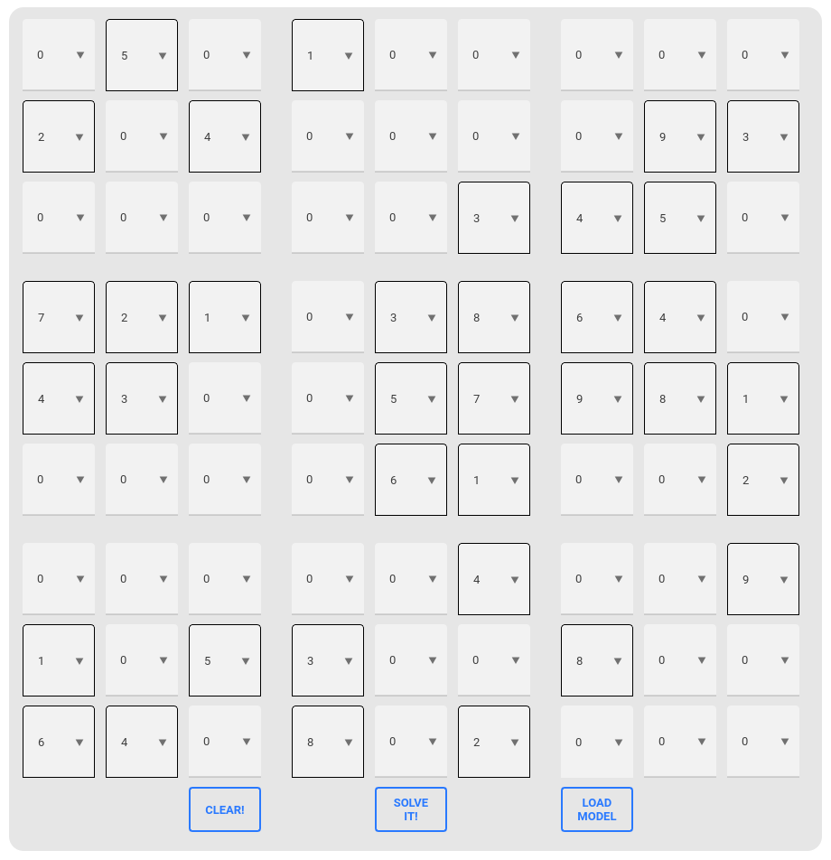
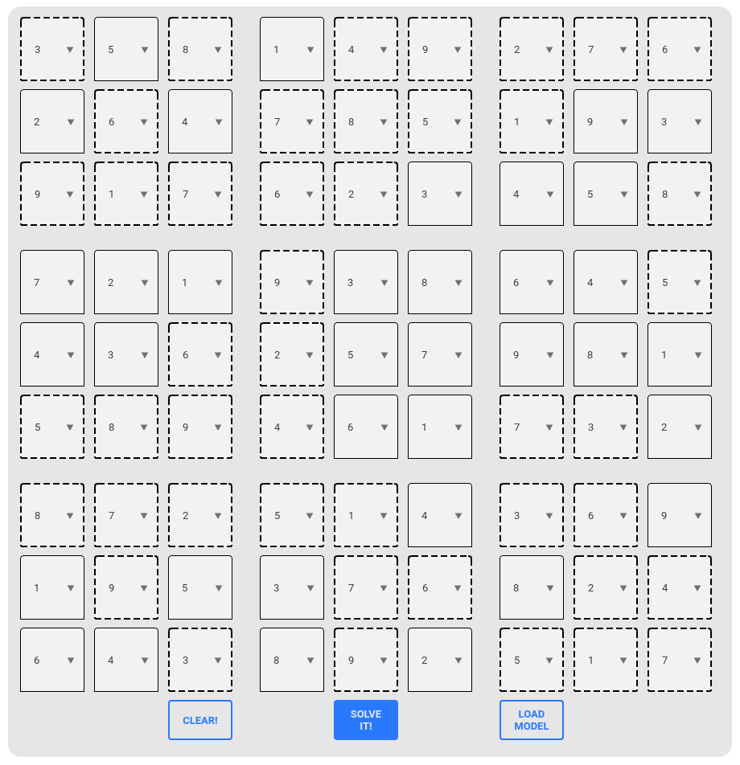

# SudokuResolver
Simple app to solve sudoku.

To solve the problem it is used MiniZinc, a free and open-source constraint modeling language, and to write the GUI is used PyQt5, a powerful python library to write a graphical interface.

| Inserting numbers | Solved sudoku |
| :---: | :---: |
|  |  |


## Installation and usage
1. Clone the repo:
```
git clone https://github.com/Luca3700/SudokuSolver.git
```
2. Install the requirements
````
pip install -r requirements.txt
````
3. Install minizinc following the documentation [here](https://www.minizinc.org/software.html)
4. Run from the home directory of the project
```
python3 main.py
```
